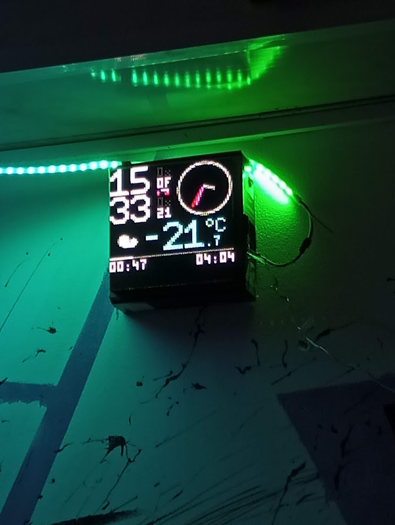

# undef_led_panel
LED-панель [undef.space](https://undef.club)



# Что делает?
Стоит на подоконнике. А ещё показывает время аж в четырёх форматах и погоду.
TODO: доделать погоду, добавить ppm CO2, спектральный анализатор, настройки,
анимации.

# Документация
Устройство состоит из трёх основных частей: 
  - RGB LED панель размером 64х64 пикселя (валялась в коробке, нашли случайно)
  - Блок питания на 5В 60А (слишком много, а ещё он громко жужжит вентиляторами)
  - ESP32

TODO: в 2035 году нужно будет обновить корневой сертификат

## Сборка
  - подключите питание панели к блоку питания
  - подключите управляющие сигналы панели к ESP:
    - R1 -> 25
    - G1 -> 26
    - B1 -> 27
    - R2 -> 14
    - G2 -> 12
    - B2 -> 13
    - LA -> 23
    - LB -> 19
    - LC -> 5
    - LD -> 17
    - LE -> 18
    - LAT -> 4
    - OE -> 22
    - CLK -> 16
    - GND -> GND
  - питать ESP можно как от USB, так и от блока питания. Не подключайте USB и
  питание от блока одновременно

## Код
Написан на C с минимально необходимым количеством C++. Используется PlatformIO с
ядром Arduino. Чтобы собрать прошивку:
  - установите VSCode и PlatformIO
  - склонируйте репозиторий
  - создайте файл `include/wifi_creds.h` со следующим содержанием:
    ```c
    #pragma once
    #define WIFI_SSID "название сети"
    #define WIFI_PASS "пароль сети"
    ```
  - нажмите галочку внизу экрана
  - подключите ESP32 по USB и нажмите стрелочку, чтобы загрузить собранную
  прошивку
