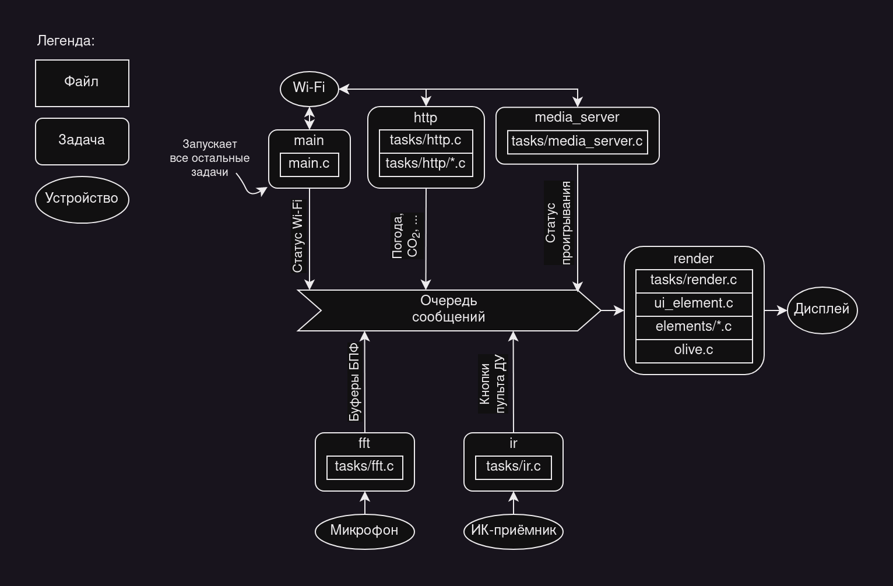

# undef_led_panel
LED-панель [undef.space](https://undef.club)


# Что делает?
Висит на стене. А ещё показывает:
  - время аж в четырёх форматах
  - погоду
  - спектр аудио
  - время, длину трека (тянет из hass-а)
  - концентрацию CO2
  
TODO: индикатор звонка, настройки, анимации.

# Документация
Устройство состоит из трёх основных частей: 
  - RGB LED панель размером 64х64 пикселя (валялась в коробке, нашли случайно)
  - Блок питания на 5В 60А (слишком много, а ещё он громко жужжит вентиляторами)
  - ESP32

TODO: в 2035 году нужно будет обновить корневой сертификат

## Сборка
  - подключите питание панели к блоку питания
  - подключите управляющие сигналы панели к ESP:
    - R1 -> 25
    - G1 -> 26
    - B1 -> 27
    - R2 -> 14
    - G2 -> 12
    - B2 -> 13
    - LA -> 23
    - LB -> 19
    - LC -> 5
    - LD -> 17
    - LE -> 18
    - LAT -> 4
    - OE -> 22
    - CLK -> 16
    - GND -> GND
  - подключите датчик светового потока TEMT6000 к GPIO33
  - подключите микрофон к GPIO32
  - подключите светодиодную ленту WS2812B к GPIO21
  - питать ESP можно как от USB, так и от блока питания. Не подключайте USB и
  питание от блока одновременно

## Код
Написан на C с использованием ESP-IDF. Чтобы собрать прошивку:
  - установите ESP-IDF
  - склонируйте репозиторий
  - создайте файл `main/include/wifi_creds.h` со следующим содержанием:
    ```c
    #pragma once
    #define WIFI_SSID   "название сети"
    #define WIFI_PASS   "пароль сети"
    #define WEATHER_KEY "ключ API OpenWeatherMap"
    #define HASS_KEY    "ключ API HomeAssistant"
    ```
  - соберите проект: `idf.py build`
  - загрузите прошивку: `idf.py flash monitor`

Создательница этого проекта перед этим долго писала на Erlang/Elixir, и поэтому
сильно упарывается по процессам и очередям. Ниже можно видеть структуру проекта:

